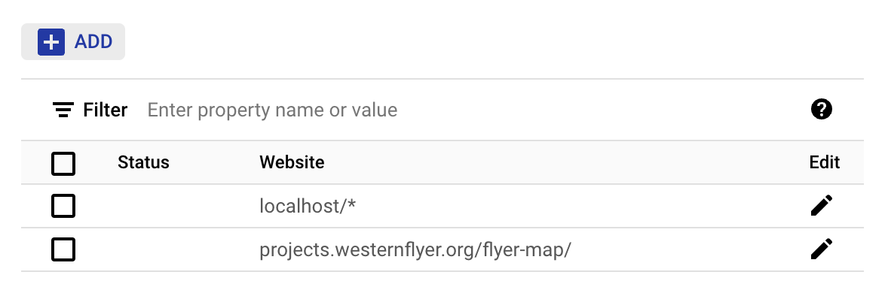

# How to use

## General data flow:

Transducer
    ↓
NMEA 2000 network
    ↓
Actisense gateway
    ↓
NMEA-MQTT gateway server
    ↓
MQTT broker
    ↓ 
client websocket

What follows are specific instructions for each point along the way.

## Actisense gateway

The Flyer map uses an [Actisense PRO-NDC-1E2K
gateway](https://actisense.com/products/pro-ndc-1e2k/) between the ship's NMEA
2000 network, and its ethernet network. It selectively passes on data,
converting it into NMEA 0183, then puts it on ethernet, where the NMEA-MQTT
gateway server picks it up.

## NMEA-MQTT server

This is a custom server runs as a daemon on an onboard computer. Its job is to
listen for NMEA 0183 sentences on the socket coming from the Actisense gateway.
As they come in, it parses the sentence, converts it to a JSON structure, which
it then publishes to the MQTT broker. It can be found at
https://github.com/westernflyer/nmea-mqtt-py.

## MQTT broker

An MQTT broker is used to act as a liaison between the boat and any client
browsers. The MQTT protocol takes minimal bandwidth, so it is excellent for
acting over a satellite or cellular connection. It should be installed on the
same server as the webserver.

1. To install an MQTT broker on a Debian server:

    ```
    sudo apt install mosquitto
    # Not essential, but useful:
    sudo apt install mosquitto-clients
    ```

2. Create a file `/etc/mosquitto/conf.d/flyer.conf` with the following contents:

    ```
    # Local settings for mosquitto

    connection_messages true
    log_timestamp true
    log_timestamp_format %Y-%m-%dT%H:%M:%S
    
    # log_type debug
    log_type error
    log_type warning
    log_type notice
    log_type information
    log_type subscribe
    log_type unsubscribe
    
    # Allow anonymous access:
    allow_anonymous true
    
    # Use an ACL file:
    acl_file /etc/mosquitto/aclfile
    
    # For authentication:
    password_file /etc/mosquitto/password_file
    
    # For an unsecured MQTT connection
    listener 1883
    
    # For a secured MQTT connection:
    listener 8883
    certfile /etc/mosquitto/certs/cert.pem
    cafile /etc/mosquitto/certs/fullchain.pem
    keyfile /etc/mosquitto/certs/privkey.pem
    
    # For a secure MQTT connection over websockets:
    listener 9001
    protocol websockets
    certfile /etc/mosquitto/certs/cert.pem
    cafile /etc/mosquitto/certs/chain.pem
    keyfile /etc/mosquitto/certs/privkey.pem
    ```

   If you are using Let's Encrypt, symbolic links for the three certificates can
   be
   found in `/etc/letsencrypt/live/yourdomain.com`. Unfortunately, Let's Encrypt
   refreshes them every 2 months, so you need to rotate new ones into place
   after
   every refresh. The script `mosquitto-copy.sh` in the directory `letsencrypt`
   can
   do this for you. Put it in the directory
   `/etc/letsencrypt/renewal-hooks/deploy`. Be sure to change the variable
   `MY_DOMAIN` to reflect your domain.

3. If you are using a remote host, you may need to punch a hole
   through its firewall for ports `1883` and `8883`, and `9001`.

4. If the NMEA-MQTT gateway server is running, double check that the topics are
   getting published:

        mosquitto_sub -h localhost -t '#' -v

   The `-t '#'` says that you want to listen to all topics. The `-v` says that
   you want to see the topic name.

## The client

Finally, we come to the client!

1. Edit the configuration file `./flyer.config.js`. In particular, set an
   appropriate
   value for `brokerUrl` and for `vesselId`. The vessel's MMSI number is usually
   used for the latter.

### Google maps

1. The system uses Google Maps, which requires an API key. After obtaining one
   from
   the [credentials](https://console.cloud.google.com/google/maps-apis/credentials)
   page, restrict the access to your key to the website you need. Here's what I
   used:

    

   Be sure to specify the trailing slash after `flyer-map`!

   You can also restrict which APIs to use. You only need "Maps JavaScript API".

2. Create a file `src/google-api-key.js` and put the key in there. When you're
   done,
   it will look something like:

        export const google_key = "yourlonginscrutablegoogleapikey";

### Install dependencies, build, then deploy the client

    npm install
    npm run build
    npm run deploy
